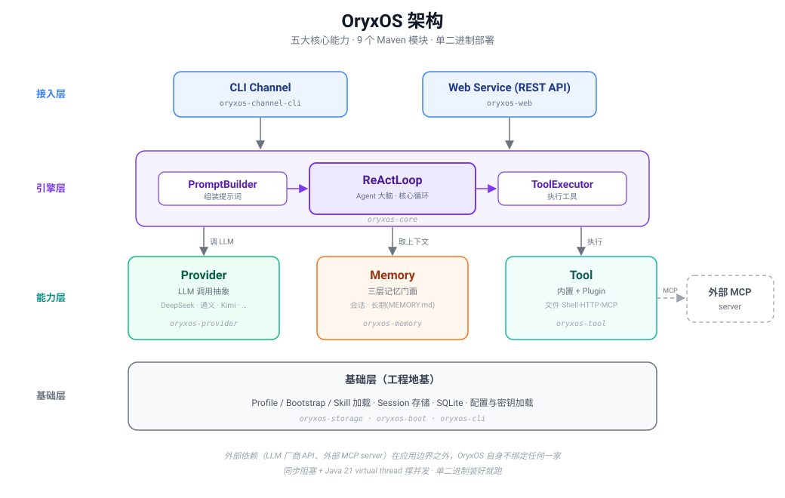

<div align="center">

# OryxOS

**企业能完全掌控的、Java 原生的、私有可审计的 Agent 统一底座**

装在企业自己的 K8s 或服务器上，作为统一底座跑各种业务 Agent，共享一套渠道接入、模型路由、工具调用、记忆系统、沙箱执行能力。数据完全留在企业基础设施，不锁任何云生态。

[](https://openjdk.org/)
[](https://spring.io/projects/spring-boot)
[](https://java2ai.com/)
[](#路线图)
[](#license)

[简介](#简介) · [定位](#定位) · [核心能力](#核心能力) · [快速开始](#快速开始) · [架构](#架构) · [路线图](#路线图) · [文档](#文档)

</div>

> **状态说明**：OryxOS 当前处于核心阶段开发中（pre-alpha）。设计文档（业界调研 / 需求 / 技术方案 / 实施指引）已完成，代码按 4 周节奏推进。本文档描述的目标形态，已落地部分见 [路线图](#路线图)。

---

## 简介

OryxOS 是基于 Java 实现的面向企业场景的 **Agent OS**——运行和管理 AI Agent 的底座系统。它装在企业自己的基础设施上，向上为各类业务 Agent（运维助手、客服助手、HR 助手、销售助手、知识管理助手等）提供统一的运行环境，向下接入模型、渠道、工具、记忆、身份和审计基础设施。

业务方在 OryxOS 上**配置** Agent（prompt、模型、Tool 列表、渠道绑定），Agent 跑起来；写 Tool 接入企业自有系统，Agent 就能用上。**业务方不需要写 Agent 后端代码，Agent 是配置出来的，不是写代码写出来的。**

### 为什么需要 OryxOS

业界对企业 AI Agent 的需求已经形成共识，但真正的难点不在"做出一个 Agent"，而在"让它在企业里可控地跑起来"。大量 agent pilot 永远到不了 production——集成、数据访问、实施成本、变更管理、安全治理，没有一个是"模型不够强"能解决的，全都是"底座不够稳、不够可控"的问题。

对银行、政府、电信、能源、医疗这些**严监管企业**，需求是确定且刚性的：核心数据不能出企业、系统必须完全可审计、新组件要过现有安全合规流程、技术栈要跟现有体系对齐。他们不会把核心业务 Agent 跑在 SaaS 上，不会跑在绑定公有云的产品上，也很难把一个有 CVE 史、默认权限宽松的项目放进生产。**他们需要一个私有部署、完全可审计、能纳入现有 IT 治理、跟现有技术栈对齐的 Agent 底座。** 这个需求当前无人满足，OryxOS 填这个位置。

### 设计目标

四个词：**统一、私有、易接入、可观测**。

- **统一**——企业内多个 Agent 共享一套底座，上一个新 Agent 不用重复造轮子。
- **私有**——数据和部署完全在企业自己手里，模型可接外部 API 也可用本地 Ollama / vLLM。
- **易接入**——基于标准 Spring Boot 工程结构，跟现有 ERP/CRM/CMDB/SSO/监控直接对接，Tool 用 MCP 任何语言都能写。
- **可观测**——标准 Prometheus 指标、结构化日志、健康检查，适配企业现有监控告警体系。

---

## 定位

### 与相邻概念的区别

| | 产物 | 谁来用 | 跑在哪层 | 跟 OryxOS 的关系 |
| --- | --- | --- | --- | --- |
| **框架**（LangChain / Spring AI） | 代码 | 开发者 | 最底层组件 | 被 OryxOS 复用（做 LLM 调用） |
| **编排平台**（Dify / Coze） | 一条 workflow | 业务人员拖拽 | 应用层 | 可跑在 OryxOS 之上 |
| **大厂中台 / SaaS**（Glean / Bedrock AgentCore） | 完整应用 | 企业采购方 | SaaS，绑云生态 | 不同象限，不可私有部署 |
| **OryxOS** | 配置出来的常驻 Agent | 业务方配置 + 写 Tool | 运行时层 | 装在自己机器上的运行时 |

一句话：**框架给你代码要你自己搭运行环境；编排平台给你流程跑在运行时之上；OryxOS 给你运行时本身——让 Agent 能常驻、可治理、可审计地跑起来的底座。** OryxOS 刻意不做可视化编排，不跟 Dify 抢应用层，专注做下面那层稳的底座。

### 与其他开源 Agent OS 的区别

| | OpenClaw | Hermes Agent | **OryxOS** |
| --- | --- | --- | --- |
| 实现语言 | Node.js | Python | **Java** |
| 定位 | 个人 | 个人到小团队 | **严监管企业** |
| 企业级治理（多租户/SSO/审计） | 弱，需二次加固 | 部分支持 | day one 设计（扩展阶段补齐） |
| Java 生态对齐 | ✗ | ✗ | ✓ |

三者都是 Agent OS，通过 `SKILL.md`（兼容 [agentskills.io](https://agentskills.io) 开放标准）互通，生态互补不竞争。OryxOS 把"企业完全可控 + Java 原生"这个特定取向做到位。

---

## 核心能力

核心阶段优先做五大核心能力，基于这五个能力可以扩展出企业里大量真实场景：

| 能力 | 说明 |
| --- | --- |
| **① 对接 LLM** | 通过 Provider 抽象层对接主流大模型（DeepSeek、通义、Kimi、智谱、混元、豆包、Anthropic、OpenAI 等），Agent 不感知具体调的是哪家，运行时切换无 lock-in。基于 Spring AI Alibaba，不重复造轮子。 |
| **② ReAct 循环** | Agent 的大脑。LLM 思考是否调工具、调哪个，调用后看结果再决定下一步，直到给出最终响应。核心循环自实现（约数十行 Java），不依赖 Spring AI 的 Agent 抽象，完全可控。 |
| **③ Memory 三层记忆** | 会话记忆（当前对话历史）+ 长期记忆（`MEMORY.md` 文件，跨对话保留用户偏好/项目背景）+ 情景记忆（任务过程状态，扩展阶段）。让 Agent 跨对话记住用户，这是 Agent OS 区别于 chatbot 的核心体验。 |
| **④ Plugin Tool 体系** | 内置 5 个基础 Tool（文件/Shell/HTTP/save_memory/recall_memory）+ Plugin 三档接入（见下）。让 Agent 真正能干企业的活。 |
| **⑤ Web Service** | 完整 REST API 对外门面，业务系统用 HTTP 调一下就能用上 Agent。核心阶段 10 个端点。这是企业把 AI 能力嵌入已有业务系统的唯一通道。 |

### Plugin Tool 三档接入

业务方扩展 OryxOS 能力，按门槛从低到高三种方式，**能用低门槛就不用高门槛**：

| 方式 | 门槛 | 做法 | 适合场景 |
| --- | --- | --- | --- |
| **零代码**（主推） | 写一份 markdown | 写 `SKILL.md` 描述意图 + 复用社区现成 MCP server（GitHub/Slack/Notion…），LLM 自己理解任务、组合调用 | 快速上线新场景 |
| **轻代码** | 任何语言写 MCP server | 通过标准 MCP 协议暴露工具，OryxOS 作为 MCP Client 接入 | 接入企业自有系统（ERP/CRM/CMDB） |
| **重代码** | Java Spring Bean | 用 `@Tool` 注解写 Java 方法，启动时自动扫描注册 | 深度集成企业内部 Java 服务、复用现有 Spring Bean |

五个能力像五个齿轮，组合起来能解决企业大量真实场景：全渠道客服、运维自愈、研发助手、知识管理、销售洞察、数据分析……OryxOS 不绑定具体业务，业务方按自己需求组合。

---

## 快速开始

### 前置要求

- JDK 21 及以上
- Maven 3.9+（或直接用仓库自带的 Maven Wrapper `./mvnw`，无需安装 Maven）
- 一个 LLM API key（如 [DeepSeek](https://platform.deepseek.com/) 或 [Kimi](https://platform.moonshot.cn/)）

### 安装与运行

```bash
# 1. 构建 fat JAR
./mvnw clean package

# 2. 初始化工作区（在当前目录生成 .oryxos/）
oryxos init

# 3. 配置 LLM API key（通过环境变量注入，不明文写进配置文件）
export DEEPSEEK_API_KEY=sk-xxx

# 4. 编辑默认 Profile，填入 Provider 和模型
#    .oryxos/profiles/default.yaml

# 5. 交互式对话（开发调试主要方式）
oryxos chat

# 6. 或启动 HTTP API 服务，供业务系统集成
oryxos serve  # 默认端口 8080
```

### 通过 REST API 调用

```bash
# 创建会话
curl -X POST http://localhost:8080/api/v1/sessions \
  -H "Content-Type: application/json" \
  -d '{"profile":"default","user_id":"u1"}'

# 发消息（保持会话上下文）
curl -X POST http://localhost:8080/api/v1/sessions/{id}/messages \
  -H "Content-Type: application/json" \
  -d '{"message":"查一下北京天气并告诉我穿什么"}'

# 无状态调用一次 Agent（适合短任务）
curl -X POST http://localhost:8080/api/v1/agents/default/invoke \
  -H "Content-Type: application/json" \
  -d '{"message":"查一下北京天气并告诉我穿什么"}'
```

完整 API 文档启动后访问 `http://localhost:8080/swagger-ui`（OpenAPI 3.0）。核心阶段 10 个端点见 [需求文档](docs/RequirementDoc.md) 第 5.8 节。

---

## 架构

OryxOS 是一个 Spring Boot 单体应用，对外只有两个入口（CLI Channel、Web Service），消息最终都汇入同一个 ReAct 引擎。引擎调度三块能力（Provider / Memory / Tool），之下是存储层。



### Maven 模块

| 模块 | 职责 |
| --- | --- |
| `oryxos-core` | 核心引擎：`ReActLoop`、`PromptBuilder`、`ToolExecutor`、`ContextLoader`、`Session`、`Profile`、`OryxTool` 抽象 |
| `oryxos-provider` | Provider 抽象、Function Calling 适配、provider name 显式映射 |
| `oryxos-memory` | `MemoryService` 三层统一门面、`LongTermMemory`、`MemoryTools` |
| `oryxos-tool` | 内置 Tool（File/Shell/Http）、MCP Client、`ToolRegistry`、`SandboxChecker` |
| `oryxos-web` | `WebServer`、6 个 `ApiController`、`GlobalExceptionHandler`、OpenAPI |
| `oryxos-channel-cli` | CLI Channel |
| `oryxos-storage` | SQLite（`sessions`、`tool_invocations`、`llm_calls`） |
| `oryxos-cli` | Picocli 命令行入口（12 子命令） |
| `oryxos-boot` | Spring Boot 启动模块，打成 fat JAR |

模块间通过接口解耦，扩展阶段加新 Channel / Provider / Tool 只在边缘扩展，不动核心引擎。

---

## 配置

### Profile（一个 Agent 的完整配置）

一个 Profile 对应一个 Agent，用 YAML 描述：

```yaml
name: ops-assistant
description: 运维助手
identity:
  agent_name: ops-assistant
  prompt: 你是一个运维助手，负责告警分诊、日志查询和服务重启。
  # 或引用人格文件：prompt_file: SOUL.md
provider:
  name: deepseek
  model: deepseek-chat
  temperature: 0.7
tools:
  - read_file
  - write_file
  - shell
  - http_get
  - save_memory
  - recall_memory
skills:
  - daily-pr-digest
mcp_servers:
  - github-mcp
channels:
  - cli
bootstrap:
  - AGENTS.md
  - SOUL.md
  - USER.md
settings:
  max_iterations: 10
  max_history_turns: 20
```

### 工作区结构

`oryxos init` 生成 `.oryxos/` 工作目录：

```text
.oryxos/
├── profiles/          # Profile YAML（每个 Agent 一个）
├── sessions/          # 会话数据
├── skills/            # SKILL.md 文件
├── memory/MEMORY.md   # 长期记忆（Agent 通过 save_memory 写入）
├── logs/              # 结构化日志
├── tools/             # 自定义 Tool 配置
├── mcp_servers.yaml   # MCP server 配置
├── oryxos.db          # SQLite（Session + 审计表）
├── AGENTS.md          # Bootstrap：项目级 agent 行为说明
├── SOUL.md            # Bootstrap：agent 人格定义
└── USER.md            # Bootstrap：用户偏好
```

### 命令行

三种运行模式（共享同一份 Profile 配置和 Session 存储）：

| 命令 | 说明 |
| --- | --- |
| `oryxos chat` | 交互式多轮对话（开发调试主要方式，可选 `--profile`） |
| `oryxos serve` | 启动 HTTP API 服务（默认 8080） |
| `oryxos gateway` | 常驻守护进程（多 Channel，核心阶段挂 CLI + HTTP API） |

核心 12 个命令：`init`、`status`、`chat`、`serve`、`gateway`、`profile list/create/show/delete`、`provider list`、`tool list`、`session list`。

---

## 路线图

OryxOS 的交付分两段：**核心阶段先把 Agent OS 的运行时内核用 Java 做扎实**（能力上对齐业界开源 Agent OS 基础层）；**真正的差异化治理层在核心内核之上、由扩展阶段和社区共建陆续补齐**。核心阶段是地基，企业级治理是终局。

### 核心阶段（4 周，每周 3 小时，合计 12 小时）

| 周次 | 核心能力 | 周末可演示成果 |
| --- | --- | --- |
| 第一周 | 对接 LLM + ReAct 循环 | Agent 能多轮对话并调 HTTP Tool 完成简单任务 |
| 第二周 | Memory + Tool 体系 | Agent 能记住偏好、调文件读写、调外部 MCP 工具 |
| 第三周 | Web Service | 外部系统能通过 10 个 REST 端点调用 OryxOS |
| 第四周 | 多 Agent 演示 + 工程化收尾 | 多 Agent 并存、CLI 完整、Session 跨重启恢复、主页可访问 |

### 扩展阶段（社区接力）

- **渠道和模型层**：多 Channel（企业微信/飞书/钉钉/Slack/邮件）、Provider Fallback 与可靠性、Adaptive Routing
- **记忆和能力层**：Memory 自动抽取、语义检索（向量库）、情景记忆、Memory Wiki、完整 Skill 体系
- **工具和安全层**：MCP Server 暴露、Tool Policy、Tool LRU 加载、完整 Sandbox 隔离（Docker/K8s pod）
- **治理和运维层**：Web 仪表板、SSO 和多租户（SAML/OIDC）、完整审计与可追溯、集群化部署与高可用
- **企业集成层**：ERP/CRM/CMDB/监控系统/内网知识库 connector

### 社区共建

Skills Marketplace、SDK 多语言（Java/Python/TypeScript/Go）、可视化 Profile 编辑器、Native 文件生成、多区域部署、Kubernetes Operator、移动端管理台、Voice Channel、RISC-V 和边缘部署。

---

## 文档

- [业界调研](docs/IndustryResearch.md) — 什么是 Agent OS、业界做到哪、Java 生态缺在哪、OryxOS 定位与愿景
- [需求文档](docs/RequirementDoc.md) — 五大核心能力 + 支撑模块的功能/非功能需求、4 周节奏、5 个验收 demo
- [技术方案](docs/TechnicalSolution.md) — 7 个关键决策、9 模块架构、数据持久化、5 个端到端流程
- [AI 编程实施指引](docs/AiProgrammingGuilde.md) — Spec-Kit + 手动提示词的混合实施模式、5 个 user story 拆解

---

## 贡献

OryxOS 核心阶段之后以开源社区方式长期维护。欢迎贡献！

- 主仓库 issue 标注 `good-first-issue`、`feature-request`、`long-term-goal`，从合适的 issue 起步
- 增量开发（加 Channel、修 bug、加 Plugin Tool）用 Claude Code 等工具直接在已有代码上改，提 PR 即可；大 feature（新增模块、改 constitution、跨多核心能力）可走 Spec-Kit 流程
- 贡献的代码需遵守项目的非协商原则（见 [CLAUDE.md](CLAUDE.md) 的 Constitution 段）
- 贡献者指南 `CONTRIBUTING.md`、API 参考文档、部署运维手册作为社区共建项目陆续补齐

---

## 相关项目与致谢

OryxOS 借鉴了开源 Agent OS 领域已被验证的设计哲学，并站在 Java 生态成熟基础设施之上：

- [OpenClaw](https://github.com/openclaw/openclaw) 与 [Hermes Agent](https://github.com/NousResearch/hermes-agent) — 开源 Agent OS 的设计先行者
- [Spring AI](https://docs.spring.io/spring-ai) / [Spring AI Alibaba](https://java2ai.com/) — Java LLM 调用层
- [Model Context Protocol](https://modelcontextprotocol.io) — LLM 与外部工具连接的开放协议
- [agentskills.io](https://agentskills.io) — Skill 开放标准

---

## License

待定（TBD）。核心阶段代码落地后确定开源协议。
